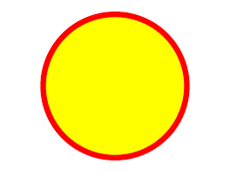

# How to Create SVG Images
**Author: Cory Schneider**

The purpose of this tutorial is to provide an easy way to start creating SVG images, showing how to adjust simple shapes and color.
A good video reference that goes a bit more in detail is [A beginners guide to SVG | Part One: The Why, What, and How](https://www.youtube.com/watch?v=ZJSCl6XEdP8)
This tutorial is designed for someone with very little to no experience creating SVG images. 

## Requirements
- A plain text editor
- A decent understanding of basic HTML and XML

Once you have a plain text editor open, an easy image to create right away and gain an understanding of what's going on is a simple circle.

**To do this, start off with:**

    <html>
    <body>
    
    <svg width="100" height="100" >
    	<circle cx="50" cy="50" r="30"  />
    </svg>
    
    </body>
    </html>
*This should produce an image that looks like this:*

These numbers listed above can be adjusted to change the width, height, X coordinate, Y coordinate, and the radius. To add color, we would add "stroke", "stroke-width" and "fill". This should look like:

    <html>  
    <body>  
      
    <svg width="100"  height="100">  
    <circle cx="50"  cy="50"  r="30"  stroke="blue"  stroke-width="3"  fill="red"  />  
    </svg>  
      
    </body>  
    </html>

<html>  
<body>  
  
<svg width="100"  height="100">  
<circle cx="50"  cy="50"  r="30"  stroke="blue"  stroke-width="3"  fill="red"  />  
</svg>  
  
</body>  
</html>

Another example of what an SVG circle should look like is:

Other predefined shape elements include:
- Rectangle `<rect>`
- Ellipse `<ellipse>`
- Line `<line>`
- Polyline `<polyline>`
- Polygon `<polygon>`
- Path `<path>`

[MarkdownFile2](CoryS2.md)