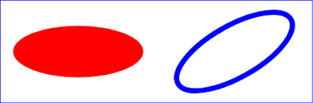

# Ellipse
**Good video tutorials for an Ellipse include:**
- [SVG Ellipse[(https://www.youtube.com/watch?v=H6jlhLtdgqg)
- [SVG Tutorial | HOW TO MAKE SVG Ellipse IN SVG](https://www.youtube.com/watch?v=kto3ttclfag)

To create an ellipse we would shape the **X** and **Y** the same way as a circle:
 

     <svg height="140"  width="500">  
    <ellipse cx="200"  cy="80"  rx="100"  ry="50"

Next, choose the colors and stoke width the same as in a rectangle:

    <svg height="140"  width="500">  
    <ellipse cx="200"  cy="80"  rx="100"  ry="50"  
    style="fill:yellow;stroke:purple;stroke-width:2"  />  
    </svg>

*This image should display:*

   
Here is a couple more examples of Ellipses:

[MarkdownFile4](CoryS4.md)