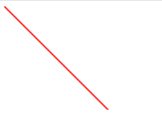

# Line
**Good video tutorials for an SVG line include:**
- [SVG Line](https://www.youtube.com/watch?v=PrM8F9uflUc)
- [SVG line drawing animation](https://www.youtube.com/watch?v=k-SI1xHN0x8)

Creating a line should look like:

    <svg height="150"  width="300">  
    <line x1="0"  y1="0"  x2="350"  y2="350"  style="stroke:rgb(255,0,0);stroke-width:2"  />  
    </svg>
*This should produce an SVG image that looks like this:*

Another example of an SVG line is:

[MarkdownFile5](CoryS5.md)