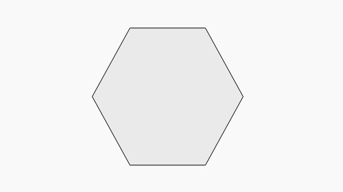

# Polygon

**Good video tutorials for an SVG Polygon Include**
- [SVG Polygon](https://www.youtube.com/watch?v=OLUMeqSXPZY)
- [SVG Polygon | Create a polygon using svg | HTML5 Tutorial](https://www.youtube.com/watch?v=Vllis9M1RbY)

**Example for a polygon:**

    <html>
    <body>
    
    
    <svg height="250" width="350">
    	  <polygon points="100,5 125,95 80,105" style="fill:red;stroke:black;stroke-width:2" />
    </svg>
    
    </body>
    </html>
*This should produce an image that looks like this:*

Notice the points of the shape are listed by "x,y x2,y2, x3,y3" and different from the circle, the fill, stroke, and stroke width start with "style=". 

Another example of what an SVG polygon should look like is:

[MarkdownFile1](CoryS1.md)